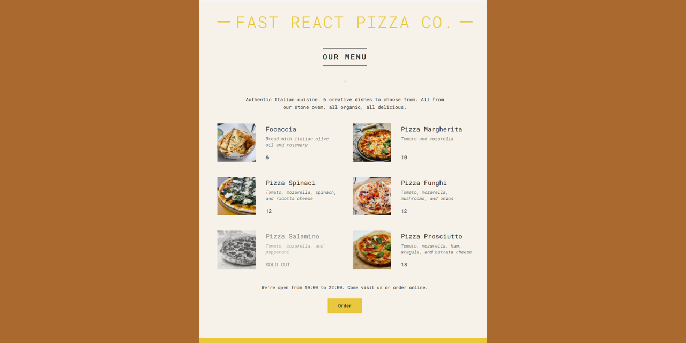

### react-1-pizza-menu

# 🍕 "Pizza Menu"

## Table of contents

- [Project Title](#"Pizza-Menu")
- [Overview](#overview)
- [The Project](#the-project)
- [Technology stack](#technology-stack)
- [Links](#links)
- [Visuals](#visuals)
- [Project Status](#project-status)
- [Author](#author)

## Overview

### The Project

The project from 'The Ultimate React Course 2025: React, Next.js, Redux & More' on Udemy by Jonas Schmedtmann.

### Technology stack

- HTML
- CSS
- JavaScript
- React

### Links

- Source code repository URL: [Github](https://github.com/basiacarvalho/react-1-pizza-menu)
- Live Site URL: [Live demo](https://basiacarvalho.github.io/react-1-pizza-menu/)

### Visuals

#### Desktop view :

### Project Status

- Completed (with the possiblity for future adaption)\
  The basic concepts of the project have been met, however further ideas may be implemented and added in the future.

### Author

👩‍💻 The "Pizza Menu" is the result of taking part in a course on Udemy: 'The Ultimate React Course 2025: React, Next.js, Redux & More' by Jonas Schmedtmann. The code comes from the course content (The "README.md" file was created by me).

### Available Scripts

In the project directory, you can run:

#### `npm start`

Runs the app in the development mode.\
Open [http://localhost:3000](http://localhost:3000) to view it in your browser.
